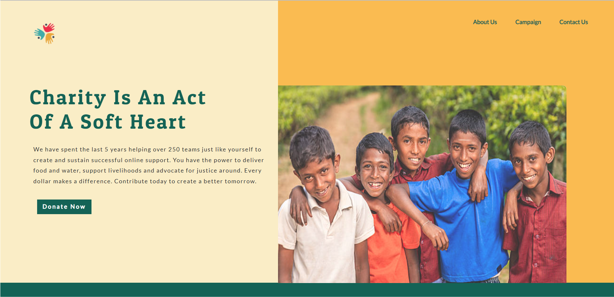
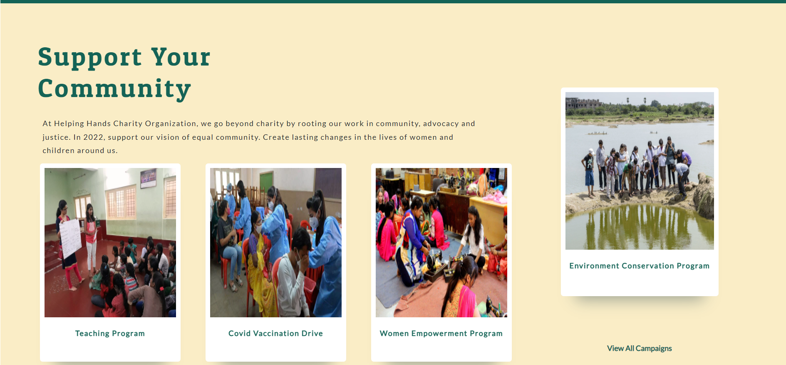
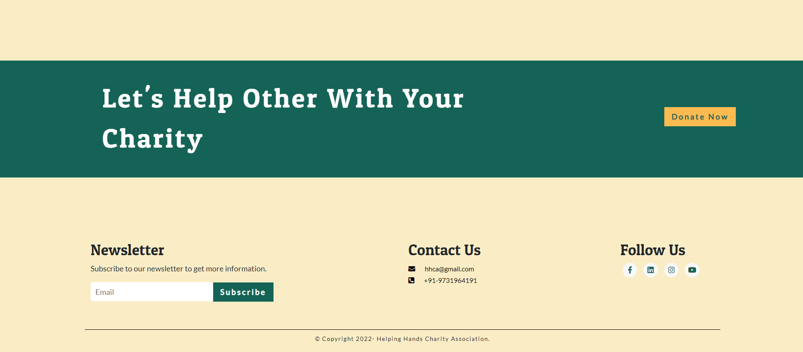
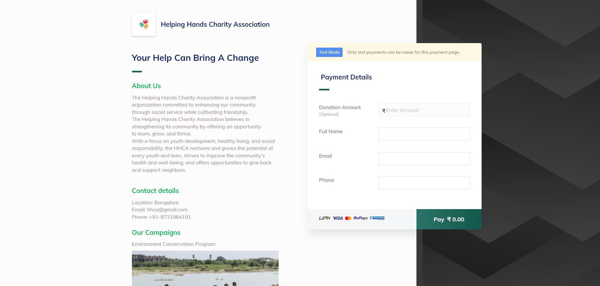
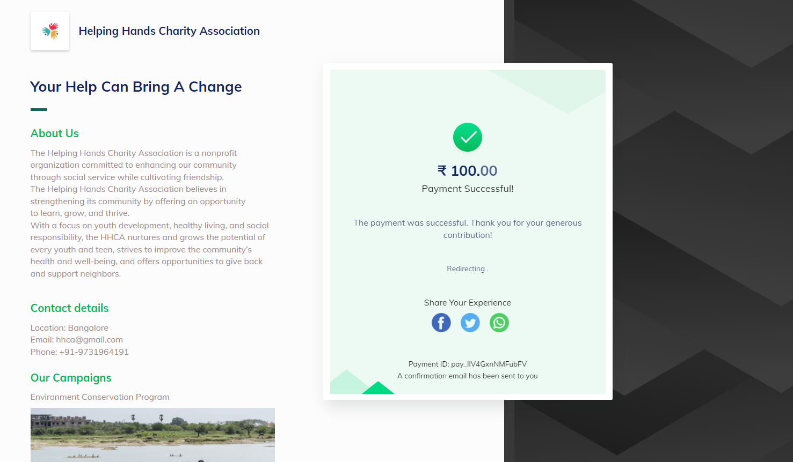

# The Sparks Foundation Tasks

This repository contains the tasks I completed while working as an intern for [The Sparks Foundation](https://www.thesparksfoundationsingapore.org/).

- **Internship Category** - Web Development and Designing
- **Internship Duration** - 1 Month ( January,2022 - February,2022)
- **Internship Type** - Work from Home

### Internship Task- Payment Gateway Integration
Deployed website - [Helping Hands Charity Association](https://helpinghandscharityassociation.netlify.app/)

#### About
>Created a simple website where payment gateway is integrated. There is a simple donate button on homepage, on clicking the donate button, the user will land on the payment page where user can select the amount to be paid and the payment type that includes Credit Card, Netbanking, UPI and Debit Card. On successful payment an invoice will be generated on a new page regarding completion of the payment and an email would be sent regarding the same. The payment integration was made with **RazorPay Payment System**.

#### Screenshots
 

 

 

 

 

#### Technologies Used
* HTML5
* CSS3
* Javascript
* Bootstrap 5

#### Status
> Project - Completed
